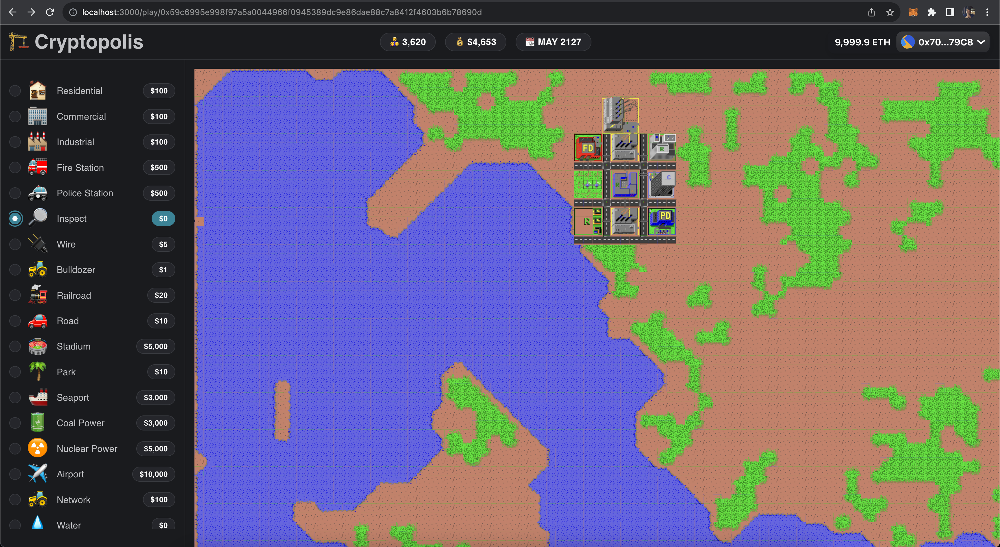

# Cryptopolis

Cryptopolis brings back the original city simulator that started it all in 1989 to the crypto era. Build a city using the same game engine but with real economics.

SimCity was launched back in 1989 developed by the legendary game designer Will Write. In 2008, the engine C code was ported to C++ and released as free software under the GPL-3.0-or-later license, renamed to Micropolis for trademark reasons.

This project was developed for the [ETHOnline 2023](https://ethglobal.com/events/ethonline2023/) event and the first [Cartesi](https://cartesi.io/) Experiment Week.

## How it works

Cryptopolis uses the exact same C++ engine of [Micropolis](https://github.com/SimHacker/micropolis), the open source version of SimCity Classic.

The first step was to build the engine to the RISC-V target architecture, so it can run inside a [Cartesi Machine](https://docs.cartesi.io/cartesi-machine/). The code builds successfully unmodified. One small addition to the original code was minimalist [Node.js binding](https://github.com/nodejs/node-addon-api) for the engine, so it could be used by a Node.js application.

The second step was to developed a Node.js application that uses the engine to run the game simulation as a [Cartesi Rollups](https://docs.cartesi.io/cartesi-rollups/) application. That also includes implementing an integration of the game economy with a ERC-20 token bridged from Ethereum.

The third step was to implement a new Web UI for the game, using a myriad of libraries, like [React](https://reactjs.org/), [Next.js](https://nextjs.org), [viem](https://viem.sh), [wagmi](https://wagmi.sh), [urql](https://github.com/urql-graphql/urql), [PixiJS](https://pixijs.com), [D3](https://d3js.org), [Mantine](https://mantine.dev), and others. The UI includes screens for bridging ERC-20 from Ethereum to power the game economy.

## Game Economy

The original game has a fairly complex simulation logic, but a quite simple economy. A game starts with a budget of say `$20,000`. The player then spends money to build zones, power plants, roads, and other structures. Existing infrastructure also requires resources to keep everything in good condition. Once an year the city collects taxes from the population.

The game economy is powered by a Ethereum ERC-20 token, any token, chosen by the application deployer. Preferrably a fixed supply token.

The first step to play the game is to bridge tokens from Ethereum into the L2 wallet of the game. Building a new city requires `20000` tokens. Currently a player can have only one city at a time.

When the player builds a new city, the application transfers `20000` tokens from his wallet to a special `in-game` wallet (`0x0000000000000000000000000000000000000001`), which matches the game simulations funds.

When the player make city expenses, like building new structures, or just paying for maintenance, funds are transferred from the `in-game` wallet to another special `people` wallet (`0x0000000000000000000000000000000000000002`). This is like the city hiring its people to do the work.

Once every "game year" taxes are collected, which now transfer funds from the `people` wallet to the `in-game` wallet.

In a nutshell, if the player does a good job he recovers the initial investment and make some profit. If the player does a bad job, he will lose money and eventually go bankrupt.

If the `people` wallet runs out of funds, the global economy is in trouble. The game will stop working and the player will not be able to play anymore. However the application deployer can be in control of a token supply and donate more token to the `people`, which can be seen as a World Bank providing humanitarian support.

## Subprojects

- micropolis: the original C++ game engine + Node.js binding
- dapp: a Cartesi Rollups application in TypeScript
- web: the game UI as a Next.js application

## Future Improvements

1. The simulation is currently running only as a Cartesi Rollups application. That means the game is not playable in absolute real-time, because only when a new input is received the game advances its simulation clock and updates its state. In order to run the game in real time we need to run it inside the browser, using the WebAssembly build of the Cartesi Machine, which is still [unmerged](https://github.com/cartesi/machine-emulator/pull/132) at the time of this writing.

2. This is just a prototype, a lot of features are missing in the UI, and in how the player can interfere with the game simulation. For example, the engine supports changing the tax rate, which can help the city collect more funds but repel citizens.
